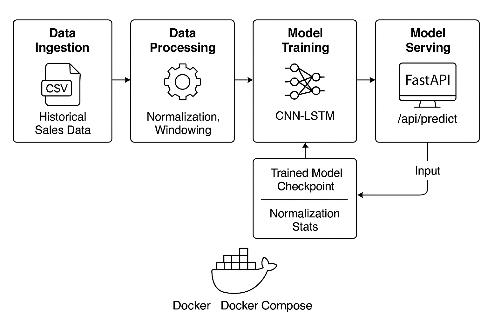

# 🧱 Architecture Overview: Predictive Sales Forecasting System

This document explains the high-level system design and code architecture of the sales forecasting ML application.

---

## 🗂️ Component Overview

### 1. **Training Pipeline (`src/ml/train/train.py`)**

* Loads historical sales data
* Normalizes time series (mean/std)
* Uses a sliding window approach to prepare samples
* Trains a CNN + LSTM model with PyTorch Lightning
* Saves:

  * Model checkpoint: `checkpoints/model.ckpt`
  * Normalization stats: `checkpoints/normalization.json`

### 2. **Model Architecture (`CNNLSTMForecastModel`)**

* 1D Convolutional layer for temporal feature extraction
* LSTM layers to model sequential dependencies
* Fully connected head for regression output

### 3. **Inference Service (`SalesForecaster`)**

* Loads model + normalization stats from disk
* Preprocesses input
* Performs forward pass
* Postprocesses output (denormalize)

### 4. **API Server (FastAPI)**

* Endpoint: `POST /api/predict`
* Validates request body (series length must match `window_size`)
* Invokes `SalesForecaster` for predictions
* Returns JSON response

### 5. **Configuration (OmegaConf)**

* Centralized in `config/config.yaml`
* Contains training, data, model, and path parameters
* Ensures reproducibility and flexibility

### 6. **Testing (Pytest + TDD)**

* `tests/ml/test_data_module.py`: Dataloader shape test
* `tests/app/test_predict.py`: API response format test

---

## 🖼️ System Architecture Diagram

```
                +--------------------------+
                |    sales_data.csv       |
                +-----------+--------------+
                            |
                      [Training Script]
                            |
          +-----------------v-----------------+
          |   SalesDataModule (Normalization) |
          +-----------------+-----------------+
                            |
                  +---------v----------+
                  |  CNNLSTM Model     | <---------+
                  +---------+----------+           |
                            |                      |
              +-------------v----------+           |
              | Checkpoint + Stats     |-----------+
              |  (model.ckpt, norm.json)|
              +-------------+----------+
                            |
                   [FastAPI Bootup]
                            |
             +--------------v---------------+
             |     SalesForecaster          |
             | (Load model + norm stats)    |
             +--------------+---------------+
                            |
                   +--------v--------+
                   |  POST /predict  |
                   |  Input: series  |
                   |  Output: float  |
                   +----------------+
```



---

## 🔧 Dev & Ops Setup

* Dockerfile + docker-compose for reproducibility
* CI workflow includes pre-commit checks (black, isort, flake8)
* All config/tunable parameters abstracted via YAML and `DictConfig`

---

## 🌱 Extensibility Ideas

* Add Prometheus + Grafana for monitoring
* Add SQLite/MLflow for model registry
* Extend to multi-product time series support
* Replace LSTM with Transformer

---

See `README.md` for usage details and setup guide.
